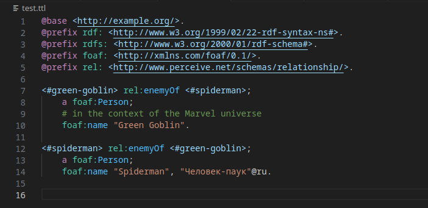
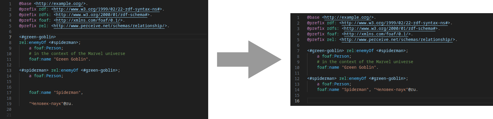
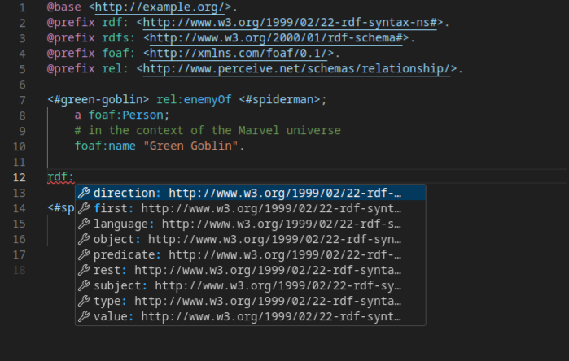

# Turtle Language Server

## Features

- Turtle semantic highlighting

- Turtle formatting

- Turtle autocompletion based on prefix.cc and defined properties in ontology file

## State of this extension

This extension is in early development, expect bugs and crashes.
Restarting the webview restarts the lsp when the lsp doens't behave anymore.

Note that probably not all predicates are returned on autocompletion, there exist a multitude of ways to defined properties.

## Bug report

Please report bugs as issue on the [github repository](https://github.com/ajuvercr/jsonld-lsp).

