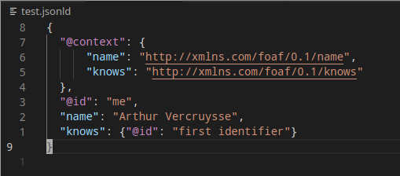

# JSON-LD LSP

## Features

- Autocompletion based on JSON-LD context.
- Autocomplete subject identifiers start by writing '@'
- Rename functionality for subjects.

## Requirements

Install the LSP: 

**Cargo**

cargo install --git https://github.com/ajuvercr/jsonld-lsp/ --bin jsonld-language-server

**Binaries**

Install binary from [Gitbub](https://github.com/ajuvercr/jsonld-lsp/).

## Settings

- Optional: "jsonld-lsp.command": set the command for the JSON-LD lsp (default: jsonld-language-server)
- Optional: "editor.semanticHighlighting.enabled": enable semantic highlighting

